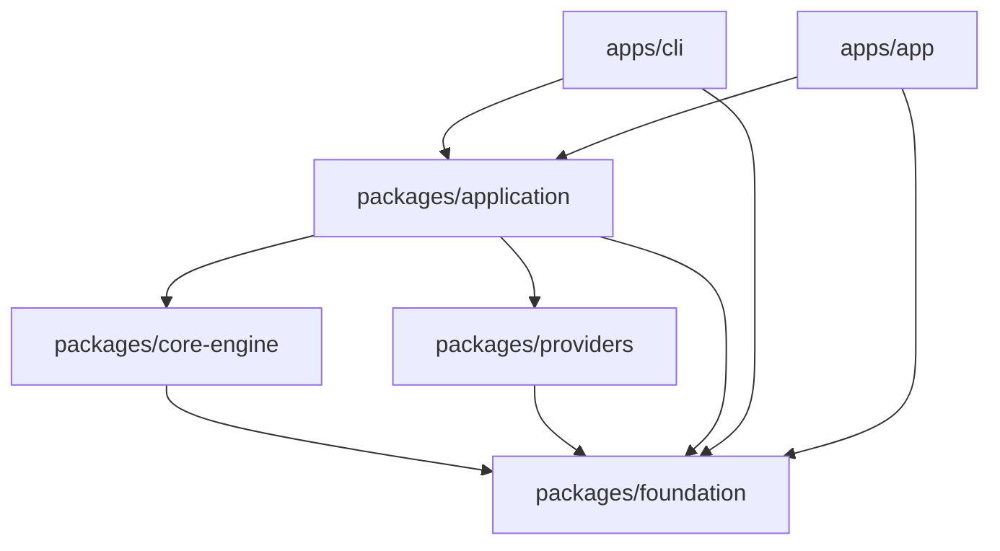

# 基础能力与日志冲刺

- 状态：ready for execution
- 范围所有者：`packages/foundation`
- 关联范围：`packages/application`、`packages/core-engine`、`packages/providers`、`apps/cli`、`apps/app`
- 共享上下文：`docs/ENGINEERING_CONTEXT.md`、各模块 `AGENTS.md`、`docs/TESTING.md`
- 约束：这是一个完整冲刺计划，不包含待决策点，不包含渐进式 rollout，不引入 legacy 兼容层

## 目标

1. 新增一个低层共享包 `@imagen-ps/foundation`，作为未来通用核心工具能力的归宿。
2. 先把日志系统做成 shared contract，再由 CLI 和 UXP 提供不同 storage adapter。
3. 让 CLI、UXP、`core-engine`、`providers`、`application` 看到的是同一套日志逻辑，同一套字段，同一套链路语义。
4. 日志以 agent 排障为第一目标：结构化、可 grep、可追链、可落盘、可测试。

## 包名与定位

选定包名：`@imagen-ps/foundation`。

选择理由：

- 比 `observability` 更宽，未来可承载日志之外的纯共享基础能力。
- 比 `shared` 更明确，不会退化成无边界杂物箱。
- 比 `platform` 更不容易和 surface app 的平台语义混淆。

定位原则：

- 只放纯共享、host-agnostic、无副作用代码。
- 允许被 `application`、`core-engine`、`providers`、`cli`、`app` 依赖。
- 绝不反向依赖任何 workspace package。
- 不放 React、DOM、Node `fs/path/os`、UXP、Photoshop、provider transport、runtime 组装逻辑。

## 当前判断

当前仓库里已经存在三类可观测来源：

- `core-engine` 的 `JobEvent`
- `providers` 的 `ProviderDiagnostics`
- `application` / `cli` / `app` 的命令与会话边界

但它们还不是统一日志系统。这个冲刺要做的是把这些来源统一到一个共享记录模型里，再由不同宿主做落盘。

## 总体规范

### 1. 统一记录模型

日志采用 JSONL / NDJSON，一行一条记录，禁止 pretty print 作为默认落盘格式。

每条记录必须是序列化稳定的纯对象，字段名固定，值必须可 JSON 序列化。

建议的主结构如下：

| 字段 | 说明 |
|---|---|
| `schema_version` | 记录格式版本，当前固定为 `1` |
| `timestamp` | ISO 8601 时间戳 |
| `level` | `debug` / `info` / `warn` / `error` |
| `event` | 稳定事件名，机器优先 |
| `surface` | `cli` / `uxp` / `test` / `unknown` |
| `package` | `foundation` / `application` / `core-engine` / `providers` / `cli` / `app` |
| `component` | 细分组件，如 `runtime`、`runner`、`dispatch`、`transport`、`host`、`sink` |
| `trace_id` | 顶层链路 ID |
| `span_id` | 当前操作 ID |
| `parent_span_id` | 上游操作 ID |
| `job_id` | job 关联 ID |
| `workflow` | workflow 名称 |
| `provider_id` | provider 标识 |
| `profile_id` | profile 标识 |
| `attempt` | 重试次数，从 1 开始 |
| `duration_ms` | 当前 span 耗时 |
| `status` | `start` / `ok` / `fail` / `retry` 等结果 |
| `error` | 结构化错误对象 |
| `attrs` | 额外结构化上下文 |
| `source` | 可选源码定位，使用相对路径 |

### 2. 事件命名

事件名必须短、稳定、可 grep，统一用 dotted form。

建议前缀：

- `cli.command.*`
- `session.command.*`
- `runtime.job.*`
- `runner.step.*`
- `dispatch.provider.*`
- `provider.http.*`
- `uxp.host.*`
- `uxp.storage.*`
- `sink.*`
- `redaction.*`

事件命名必须偏机器可读，不以长句作为默认信息源。

### 3. 链路语义

不用引入完整 OpenTelemetry SDK，但要保留 OTel Logs 关注的核心链路字段。

规则：

- 每次顶层命令或 host 入口启动时，生成一个 `trace_id`。
- 每个可观测操作生成自己的 `span_id`。
- 子操作继承同一个 `trace_id`，并写入 `parent_span_id`。
- `start` / `ok` / `fail` / `retry` 事件必须能够串成同一条链。
- `duration_ms` 只在结束类事件上写入。

### 4. 红action

默认禁止泄露以下内容：

- API key、token、secret、cookie、authorization header
- raw secret value
- 本机绝对路径
- provider 原始请求/响应整包
- 未筛选的环境变量 dump

允许保留的内容：

- 业务级 `prompt`，但只能作为显式字段写入，不能整包 dump request
- `model`、`operation`、`job_id`、`workflow`、`provider_id`、`profile_id`
- 结构化错误消息、分类、状态码、重试次数
- 相对源码路径和相对资源标识

红action必须是纯函数式的：同一输入、同一规则、同一输出。

### 5. 可写边界

共享记录模型只负责描述，不负责存储。

存储由宿主 adapter 提供：

- CLI：本地文件系统
- UXP：`localFileSystem.getDataFolder()`
- 测试：内存 sink / 临时目录 sink

shared 包不直接触达 `fs`、`uxp`、`photoshop` 或任何私有 API。

## 架构策略

### 1. 单一核心逻辑

日志核心只做四件事：

1. 组装上下文
2. 生成记录
3. 红action
4. 交给 sink

所有宿主差异都留在 sink / adapter 层，不允许出现 CLI 一套、UXP 一套、providers 再一套的分叉实现。

### 2. 双层接口

建议基础 API 分成两层：

- 记录层：`LogRecord`、`LogContext`、`LogLevel`、`LogEvent`
- 执行层：`Logger`、`LogSink`、`LogSession` / `LogSpan`

其中：

- `Logger.child()` 只做上下文合并，不改写语义
- `LogSpan` 只负责同一链路内的 `start` / `ok` / `fail`
- `LogSink` 只负责写入，不理解业务语义

### 3. 失效策略

日志系统必须 fail-open。

规则：

- 日志写失败不能阻断 job、provider、UI、CLI 命令主流程
- sink 出错时只记录一条降级诊断，然后继续或静默丢弃
- 不允许日志系统把主业务一起拖死

### 4. 目录与保留

CLI 和 UXP 的逻辑布局保持一致，只是根目录不同。

推荐布局：

- `logs/<surface>/<yyyy-mm-dd>/<session-id>.jsonl`

保留策略：

- 单文件上限固定
- 超限后轮转到新文件
- 只保留最近的有限文件数
- 旧文件自动清理

CLI 侧默认不写 stdout / stderr，避免污染命令 contract。
UXP 侧可以同时保留 console sink 和 data-folder JSONL sink。

### 5. 手动导出

导出日志不是默认写盘路径的一部分，而是独立能力。

规则：

- 导出时由用户选择目标位置
- UXP 必须通过 picker / token 路径完成
- 不写插件目录，不写任意 host 路径
- 远端上传不在本冲刺内

## 现有代码接入点

优先接入的源头如下：

| 位置 | 作用 |
|---|---|
| `packages/core-engine/src/runtime.ts` | job 创建、完成、失败 |
| `packages/core-engine/src/runner.ts` | workflow / step 执行链 |
| `packages/core-engine/src/dispatch.ts` | provider dispatch 边界错误 |
| `packages/providers/src/transport/image-endpoint/http.ts` | HTTP 请求与响应诊断 |
| `packages/providers/src/transport/image-endpoint/retry.ts` | 重试与退避 |
| `packages/providers/src/transport/image-endpoint/error-map.ts` | provider 错误分类 |
| `packages/application/src/runtime.ts` | runtime 组装、历史 flush |
| `packages/application/src/session/session.ts` | session submit / retry / subscribe |
| `apps/cli/src/index.ts` | 命令边界、parser 失败、宿主装配 |
| `apps/app/src/host/create-plugin-host-shell.ts` | UXP 端 composition root |
| `apps/app/src/host/uxp-job-history-adapter.ts` | data folder 写入路径 |

## 执行阶段

### 阶段 0 - 基线锁定

目标：

- 再确认现有事件源、边界和测试面，不改业务。

产出：

- 新冲刺计划确认可执行
- 事件源与接入点清单固定
- `packages/foundation` 的边界范围固定

验证：

- 复查 `docs/ENGINEERING_CONTEXT.md`
- 复查各模块 `AGENTS.md`
- 复查当前 `docs/TESTING.md`

停止条件：

- 发现 shared 包必须依赖 Node / UXP / React 才能成立
- 发现当前日志目标需要兼容旧格式

### 阶段 1 - 包骨架

目标：

- 创建 `packages/foundation`，建立纯共享基础包。

产出：

- `packages/foundation/package.json`
- `packages/foundation/tsconfig*.json`
- `packages/foundation/src/index.ts`
- 基础测试文件

要求：

- 只放纯函数、纯类型、纯序列化逻辑
- 公开 export 必须有中文 JSDoc
- 不能引入 workspace 反向依赖

验证：

- `pnpm --filter @imagen-ps/foundation build`
- `pnpm --filter @imagen-ps/foundation test`
- `pnpm check:policy`

### 阶段 2 - 日志核心

目标：

- 落实 `LogRecord`、`LogContext`、`Logger`、`LogSink`、`LogSpan`、红action、序列化器。

产出：

- 统一 schema
- `child` 上下文合并
- span 链路字段
- redaction 规则
- JSONL 编码 / 解码辅助

要求：

- 记录必须是确定性的
- 同样输入必须产生同样字段集合
- `attrs` 不能泄露未白名单化的整包对象

验证：

- schema 单测
- redaction 单测
- 事件命名单测
- golden JSONL 单测

### 阶段 3 - 共享源头接线

目标：

- 把现有可观测源头接到 foundation logger 上。

接线顺序：

1. `core-engine` job lifecycle
2. `runner` step 执行
3. `dispatch` provider 边界
4. `providers` HTTP / retry / error mapping
5. `application` command / session 边界

要求：

- 逻辑一致，记录一致，只有 context 和 sink 不同
- 不能在每个包里再发明一套 logger
- `ProviderDiagnostics` 只是上游输入，不是最终日志格式

验证：

- 共享事件链单测
- provider retry 链路单测
- job 生命周期链路单测
- session 传播单测

### 阶段 4 - 宿主 sink

目标：

- 为 CLI 和 UXP 提供各自 storage adapter，但复用同一套日志逻辑。

CLI sink：

- 文件落盘
- 默认不污染 stdout / stderr
- 支持配置目录或显式日志目录
- 失败时不影响命令 contract

UXP sink：

- `console` sink 作为即时观察面
- `getDataFolder()` 作为持久落盘面
- 通过 manifest 和 host 能力约束写入
- 不触碰插件目录、临时目录以外的持久路径

共同要求：

- 同一条记录在两个宿主里字段语义一致
- 只差 sink，不差 schema
- 不依赖私有 API

验证：

- CLI 子进程 contract tests
- UXP fake module / fake storage tests
- data folder 写入测试
- console mirror 测试

### 阶段 5 - 收口与文档

目标：

- 将日志计划、测试入口、边界说明一次性收口。

产出：

- 新包文档
- 必要的 `docs/TESTING.md` 补充
- 必要的边界规则补充

要求：

- 文档与代码同一批落地
- 不保留“未来再补”的占位承诺

验证：

- `pnpm build`
- `pnpm test`
- `pnpm check:policy`
- `pnpm validate`

## Harness 设计

### 1. 基础单测 harness

基础包必须先把记录格式打牢。

测试对象：

- `LogRecord` schema
- `Logger.child()` 合并规则
- `LogSpan` 链路关系
- `redaction` 规则
- `JSONL` 编码稳定性

测试方法：

- 直接断言对象，不断言格式化字符串
- 所有 fixture 使用可解析 JSON
- 只测纯函数和纯对象

### 2. 跨包链路 harness

目标是验证“同一逻辑、不同宿主”。

覆盖面：

- `core-engine` job 生命周期
- `providers` retry / error mapping
- `application` session / command
- `cli` parser / command boundary
- `app` UXP host shell

断言方式：

- 同一输入在不同包里产生相同 record 形状
- `trace_id` 连贯
- `parent_span_id` 正确
- 错误分类稳定

### 3. CLI harness

CLI 只允许在文件 sink 中看到日志。

测试要求：

- stdout 只保留命令 contract
- stderr 只保留错误 contract
- 日志写入单独的 JSONL 文件
- 不能把日志混进命令输出

优先用法：

- 子进程启动真实 `imagen`
- 临时目录隔离
- 读取实际 JSONL 文件并反序列化

### 4. UXP harness

UXP 侧必须使用 fake module / fake storage 进行可重复验证。

测试要求：

- fake `uxp.storage.localFileSystem`
- fake `console`
- fake `getDataFolder()` 行为
- fake 目录 / 文件写读

断言重点：

- 数据写入发生在 data folder 语义下
- 不触碰插件目录
- 不触碰私有 API
- 不依赖真实 Photoshop 或真实 UXP Developer Tool

### 5. Agent 排障 harness

专门为 agent 排障准备的测试约束：

- 每个失败样例都要有稳定 `event` 编码
- 每个重试样例都要能追到 `attempt` 与 `delay_ms`
- 每个错误样例都要能追到 `error.category` / `error.kind`
- 每个成功样例都要能追到 `duration_ms`
- 测试 fixture 必须覆盖 secret redaction、relative source、job/provider 关联

## 验收标准

完整达标时，必须同时满足以下条件：

1. `@imagen-ps/foundation` 存在，且只包含纯共享基础能力。
2. `core-engine`、`providers`、`application`、`cli`、`app` 都可以复用同一套日志核心。
3. CLI 和 UXP 的日志 record 逻辑一致，只差 sink。
4. 日志格式是 JSONL，字段稳定，链路可追，重试可追，错误可追。
5. secret、token、cookie、绝对路径、原始 request/response 整包不会泄露到默认日志里。
6. CLI 不污染 stdout / stderr contract。
7. UXP 不写插件目录，不依赖私有 API，不要求任意外部文件写权限。
8. 所有 public export 都有中文 JSDoc。
9. `pnpm build`、`pnpm test`、`pnpm check:policy`、`pnpm validate` 全部通过。
10. 新增测试能证明 record 形状、redaction、sink 行为和链路传播。

## 停止条件

只要出现以下任一情况，就停止并回退到设计层：

- 共享包必须依赖 host API 才能成立
- 日志 contract 需要兼容旧格式
- CLI stdout / stderr 无法继续保持纯 contract
- UXP 需要私有 API 或插件目录写入
- redaction 规则无法保证 secret 不外泄
- 需要把遥测上传作为本冲刺的默认能力

## 回滚策略

- 仅回滚本冲刺新增的 `packages/foundation`、logger 接线、sink 和测试。
- 不回滚用户已有的 unrelated 改动。
- 不通过兼容层保留废弃 contract。
- 如果某个阶段失败，删掉该阶段引入的代码与测试，回到上一个稳定阶段。

## 交付边界

本冲刺交付后，仓库会得到三件事：

1. 一个真正可复用的低层共享包。
2. 一套对 CLI / UXP 统一的结构化日志协议。
3. 一组能被 agent 直接使用的排障 harness。

这份计划就是执行入口，不需要再开决策会。
